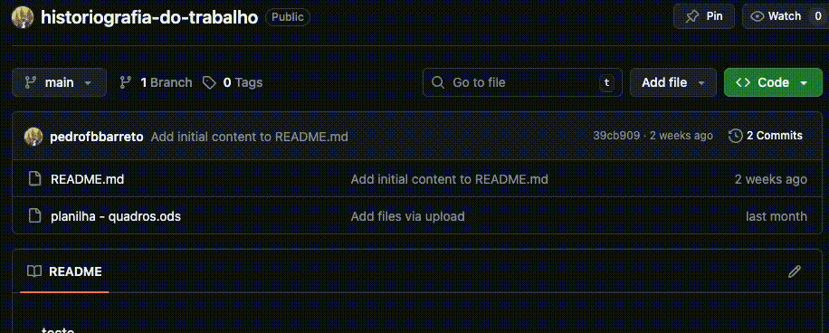

# Sobre o repositório

Este repositório é fruto de uma pesquisa de mestrado sobre a historiografia do trabalho no Brasil. A dissertação (referência inserida aqui) resultou em dois levantamentos disponíveis aqui. O primeiro é um catálogo com a produção intelectual de Emília Viotti da Costa (1928-2017). O segundo é um levantamento realizado a partir do Catálogo de Dissertações e Teses em História.

## Como baixar as planilhas

Ao acessar o repositório clique ao lado de *Code* e depois em *Download Zip*

